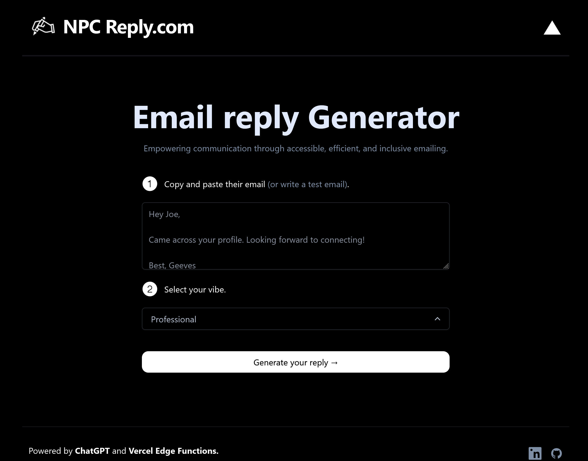

# [npcreply.com](https://www.npcreply.com/)

This project generates email replys for you using AI.

[](https://www.npcreply.com)

## How it works


REFERENCE MATERIAL:If you'd like to see who I built this from, check out the [video](https://youtu.be/JcE-1xzQTE0) or [blog post](https://vercel.com/blog/gpt-3-app-next-js-vercel-edge-functions).

## Running Locally

After cloning the repo, go to [OpenAI](https://beta.openai.com/account/api-keys) to make an account and put your API key in a file called `.env`.

Then, run the application in the command line and it will be available at `http://localhost:3000`.

```bash
npm install
```


```bash
npm run dev
```

